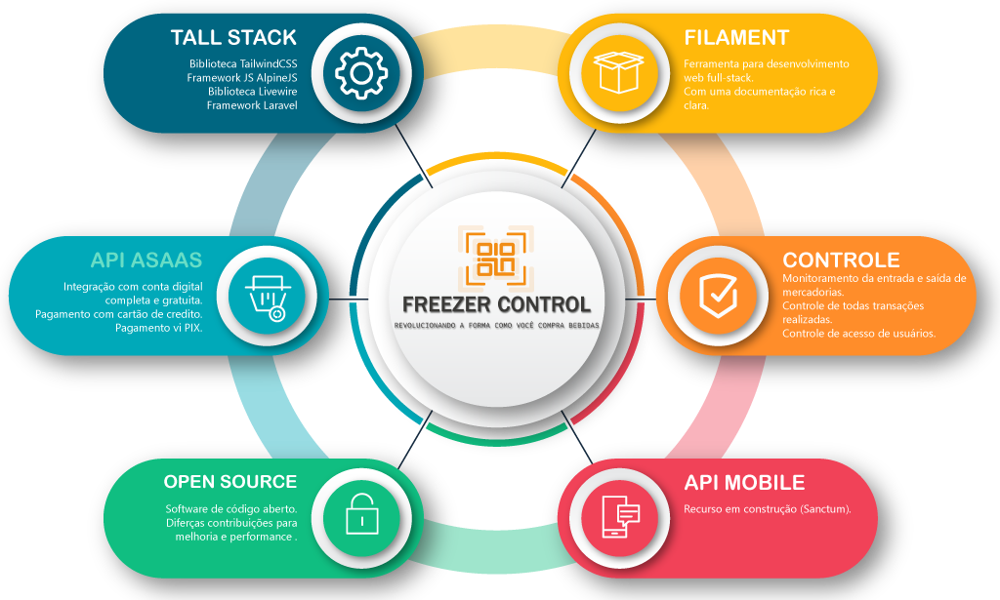
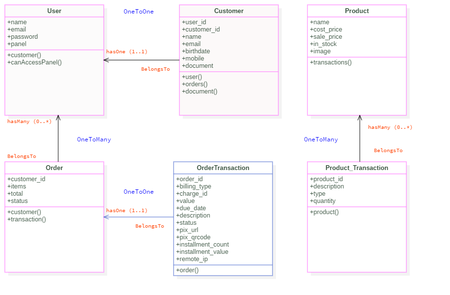

<p align="center">
	<a href="#"  target="_blank" title="Sistema de gestão de freezers">
		
	</a>
</p>

<br>

<p align="center">:rocket: Revolucionando a forma como você compra bebidas :sparkles: <a href="https://github.com/icarojobs/freezer-control">Freezer Control</a></p>

<p align="center">
	
    
    
    
    
	<a href="https://opensource.org/licenses/GPL-3.0">
		
	</a>
</p>


### :books: Contextualização e objetivo do Projeto

O projeto intitulado `Freezer Control` foi concebido para abordar um problema particular enfrentado por uma empresa 
de bebidas em pequena escala durante a realização de seus eventos. Nestas ocasiões, um freezer é disponibilizado para permitir 
que todos os participantes adquiram suas bebidas. Contudo, o procedimento atual de registro de cada venda é conduzido manualmente, 
cada cliente é incumbido de registrar cada item retirado em um caderno posicionado ao lado do freezer. Esta abordagem 
possui várias falhas, incluindo o esquecimento de fazer as anotações, a perda da caneta de anotação e registros efetuados 
em locais inadequados.
<br/>
O projeto `Freezer Control` visa resolver essas questões de maneira prática e eficaz, através da `implementação de um sistema 
digital que revoluciona a forma como as bebidas são adquiridas`. Este inovador sistema, munido das mais recentes tecnologias 
do mercado, fornecerá uma interface rápida para a aquisição de bebidas, resultando em uma operação comercial mais segura 
e lucrativa para os proprietários da empresa. Além disso, o sistema propiciará o `controle de estoque`, a `gestão de usuários` 
e o `monitoramento de vendas`.


<p align="center" style="margin-top: 40px">
	<a href="#"  target="_blank" title="Sistema de gestão de freezers">
		
	</a>
</p>

### :books: `DER` Diagramação base do projeto
> As classes do sistema estão claramente definidas em um diagrama de classes.

<p align="center" style="margin-top: 30px">
	<a href="#"  target="_blank" title="Sistema de gestão de freezers">
		
	</a>
</p

<br>


---
### :package: Dependências do projeto
 - Docker + docker-compose
 - curl
 - Make 4.x
 - [laravel](https://github.com/laravel/framework)
 - [filament](https://github.com/filamentphp/filament)
 - [filament-shield](https://github.com/bezhansalleh/filament-shield)
 - [filament-api-service](https://github.com/rupadana/filament-api-service)
 - [simplesoftwareio/simple-qrcode](https://github.com/simplesoftwareio/simple-qrcode)
 - [lara-zeus/quantity](https://github.com/lara-zeus/quantity)
 - [pt-br-validator](https://github.com/LaravelLegends/pt-br-validator)
 - [blade-fontawesome](https://github.com/owenvoke/blade-fontawesome)
 - [laravel-debugbar](https://github.com/barryvdh/laravel-debugbar)
 - [captainhook/captainhook](https://github.com/captainhookphp/captainhook)
 - [mockery/mockery](https://github.com/mockery/mockery)

---
### :books: Configurando o projeto em um novo ambiente
Simplesmente execute o comando `make` no seu terminal:
```bash
make
```

### :books: Como rodar o projeto em novo ambiente `SEM` o `make`
```comandos
# Depois que você realizar o clone faça os seguintes comandos
    php artisan storage:link
    php artisan migrate:fresh --seed
    php artisan shield:instal
```
> Usuário de acesso `admin@admin.com` e senha `password`


### :books: Como contribuir para o projeto
1. Faça o fork do projeto.
2. Crie uma nova Branch com as suas alterações: `git checkout -b my-feature`
3. Salve as alterações e crie uma mensagem de commit contando o que fez: `git commit -m ":sparkles: feat: my new feature`
4. Envie suas alterações: `git push origin my-feature`

> Caso tenha dúvidas, acesse o link do [vídeo do Tio Jobs](https://www.youtube.com/watch?v=8KsHhQ6GcBg&t=193s) de como 
> contribuir em um projeto open source ou na [documentação do github](https://docs.github.com/pt/get-started/exploring-projects-on-github/contributing-to-a-project).


Agora, basta acessar a URL `http://laravel.test`

> *OBS.:* Verifique se no seu arquivo `hosts` existe o alias para `127.0.0.1 laravel.test`.

---
### :sparkles: Tutorial de desenvolvimento no Canal do [Tio Jobs](https://www.youtube.com/@TioJobs)
:ok_hand: [PlayList completa do projeto](https://www.youtube.com/watch?v=-Jf9hgt-Fj4&list=PLbjKo3xK3gjcOz9Ocn3H6aTtTRBypCAaA&index=2)

---

### :package: Como integrar com gateway de pagamento

> :bulb: Antes de prosseguir, `assegure-se` de ter criado sua [conta no ASAAS](https://www.asaas.com), incluindo a configuração da [conta SANDBOX](https://sandbox.asaas.com), e acesse o [Guia de Integração](https://docs.asaas.com/reference/comece-por-aqui) para orientações detalhadas.
> :construction: É crucial verificar o arquivo .ENV para garantir que as variáveis da API do ASAAS estejam definidas corretamente.

Instanciar o conector (adapter) do gateway de pagamento que deseja

```bash
$adapter = new App\Services\PaymentGateway\Connectors\AsaasConnector;
```

Instanciar o cliente Gateway utilizando o adapter criado préviamente
```php
$gateway = new App\Services\PaymentGateway\Gateway($adapter);
```


Clientes:
```php
// Insere um novo cliente
$data = [
    'name' => 'Fabiano Fernandes',
    'cpfCnpj' => '21115873709',
    'email' => 'fabianofernandes@test.com.br',
    'mobilePhone' => '16992222222',
];

$customer = $gateway->customer()->create($data);

// Atualizar um cliente
$newData = [
    'name' => 'Tio Jobs',
    'cpfCnpj' => '21115873709',
    'email' => 'tiojobs@test.com.br',
    'mobilePhone' => '16992222222',
];
$customer = $gateway->customer()->update('cus_000005891625', $newData);

// Retorna a listagem de clientes
$customers = $gateway->customer()->list();

// Retorna clientes utilizando filtros
$customers = $gateway->customer()->list(['cpfCnpj' => '21115873709']);
    
// Remove um cliente
$customer = $gateway->customer()->delete('cus_000005891625');
```

> :construction: Na ausência do `cus_ID` em sua entidade `Customer`, é viável `normalizá-lo` utilizando o seguinte comando::
- php artisan normalize:customer

Cobrança:
```php
// Criar uma nova cobrança
 $data = [
        "billingType" => "BOLETO", // "CREDIT_CARD", "PIX", "BOLETO"
        "discount" => [
            "value" => 10,
            "dueDateLimitDays" => 0
        ],
        "interest" => [
            "value" => 2
        ],
        "fine" => [
            "value" => 1
        ],
        "customer" => "cus_000005891625",
        "dueDate" => "2024-02-29",
        "value" => 100,
        "description" => "Pedido 056984",
        "daysAfterDueDateToCancellationRegistration" => 1,
        "externalReference" => "056984",
        "postalService" => false
    ];
$payment = $gateway->payment()->create($data);

// Atualiza uma cobrança
$payment = $gateway->payment()->update('cus_000005891625', $newData);

// Retorna a listagem de cobranças
$payments = $gateway->payment()->list();

// Retorna cobranças utilizando filtros
$payments = $gateway->payment()->list(['customer' => 'cus_000005891625', 'status' => 'RECEIVED']);

// Remove uma cobrança
$customer = $gateway->payment()->delete('cus_000005891625');
```

### CRIAÇÃO DE ROTAS API
Estamos utilizando um plugin chamado `API Service`, encontrando no link: [https://filamentphp.com/plugins/rupadana-api-service](https://filamentphp.com/plugins/rupadana-api-service)
Esse pacote também depende do plugin `Filament Shield`, encontrado no link [https://filamentphp.com/plugins/bezhansalleh-shield#installation](https://filamentphp.com/plugins/bezhansalleh-shield#installation)

```bash
sail art make:filament-api-service BlaBlaBlaResource
```

Estrutura de Rotas Necessárias:
```
// ---------------- PAINEL ADMIN --------------------------
// Cadastro de usuário (sem autenticação)
// Login de usuário (sem autenticação)
// Informações de dashboard - mais informações do que no painel /app (logado)
// Atualização cadastral de clientes [customer] (nome, email [caso não exista], celular
//  - Já atualizar o email dele também ta tabela users (caso aplicável)

// Inventário (logado)
// Venda (venda)


// ---------------- PAINEL APP --------------------------
// Cadastro de usuário (sem autenticação)
// Login de usuário (sem autenticação)
// Informações de dashboard (logado)
// Atualização cadastral [customer] (nome, email [caso não exista], celular
//  - Já atualizar o email dele também ta tabela users (caso aplicável)

```

<h4 align="center"> 
	🚧  Projeto 🚀 em construção...  🚧
</h4>

### :construction: Pendências
- Quando realizar uma venda, baixar itens vendidos do Estoque.
- Dashboards, Relatórios, Gráficos, ETECETARASS!!!!
- Criar painel APP com a tela de "Venda" (que pode chamar "Comprar")
- Criar um globalScope/policies para que um cliente não tenha acesso a informações de outro.
- Criar Dashboards no painel APP
- Testes finais
- Correr pro abraço!

### :soon: Parte 02
 - Criar APIs para aplicativo Mobile (sanctum).

### :soon: Parte 03
 - Criar Aplicativo Mobile (Administrador + Consumidor)
 - API: [https://filamentphp.com/plugins/rupadana-api-service](https://filamentphp.com/plugins/rupadana-api-service)

https://youtu.be/-Jf9hgt-Fj4?list=PLbjKo3xK3gjcOz9Ocn3H6aTtTRBypCAaA&t=509

---
### :sparkles: Contribuidores
<table>
  <tr>
    <td align="center"><a href="https://github.com/icarojobs">
        
    <br /><sub><b>Icaro William</b></sub></a></td>
    <td align="center"><a href="https://github.com/fabianosfbr">
        
    <br /><sub><b>Fabiano Fernandes</b></sub></a></td>
    <td align="center"><a href="https://github.com/RafaelBlum">
        
    <br /><sub><b>Rafael Blum</b></sub></a></td>   
    <td align="center"><a href="https://github.com/wesleysouza-dev">
        
    <br /><sub><b>Wesley</b></sub></a></td>   
    <td align="center"><a href="https://github.com/Deathpk">
        
    <br /><sub><b>Michel Versiani</b></sub></a></td>
  </tr>

  <tr>
    <td align="center"><a href="https://github.com/TiagoLemosNeitzke">
        
    <br /><sub><b>Tiago Lemos Neitzke</b></sub></a></td>
    <td align="center"><a href="https://github.com/rodrigomedeirosbrazil">
        
    <br /><sub><b>Rodrigo Medeiros</b></sub></a></td>
    <td align="center"><a href="https://github.com/norbberto">
        
    <br /><sub><b>NORBERTO CORDEIRO</b></sub></a></td>
    <td align="center"><a href="https://github.com/arthurfabiano">
        
    <br /><sub><b>Arthur Fabiano</b></sub></a></td>
    <td align="center"><a href="https://github.com/jeffersonsimaogoncalves">
        
    <br /><sub><b>Jèfferson Gonçalves</b></sub></a></td>
  </tr>
</table>

> Ninguém é tão sábio que não tenha algo para aprender e nem tão tolo que não tenha algo pra ensinar. `Blaise Pascal`.
